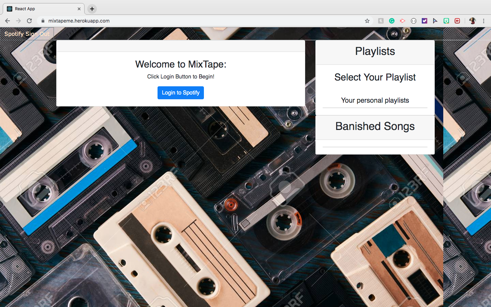
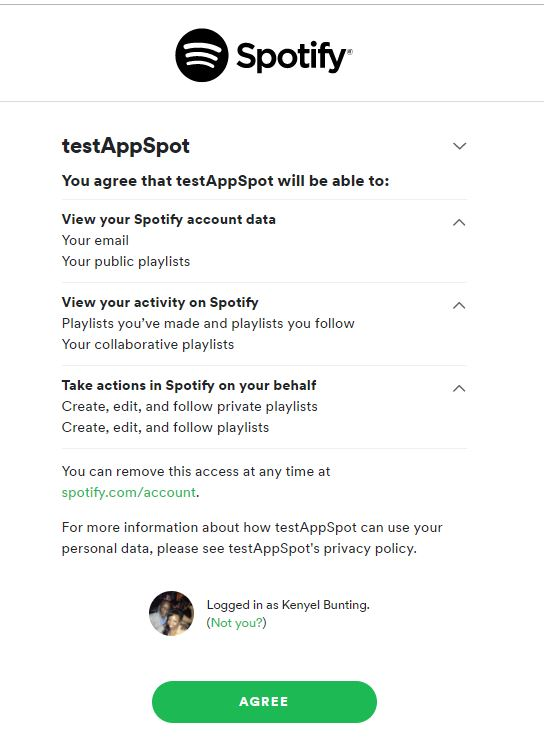
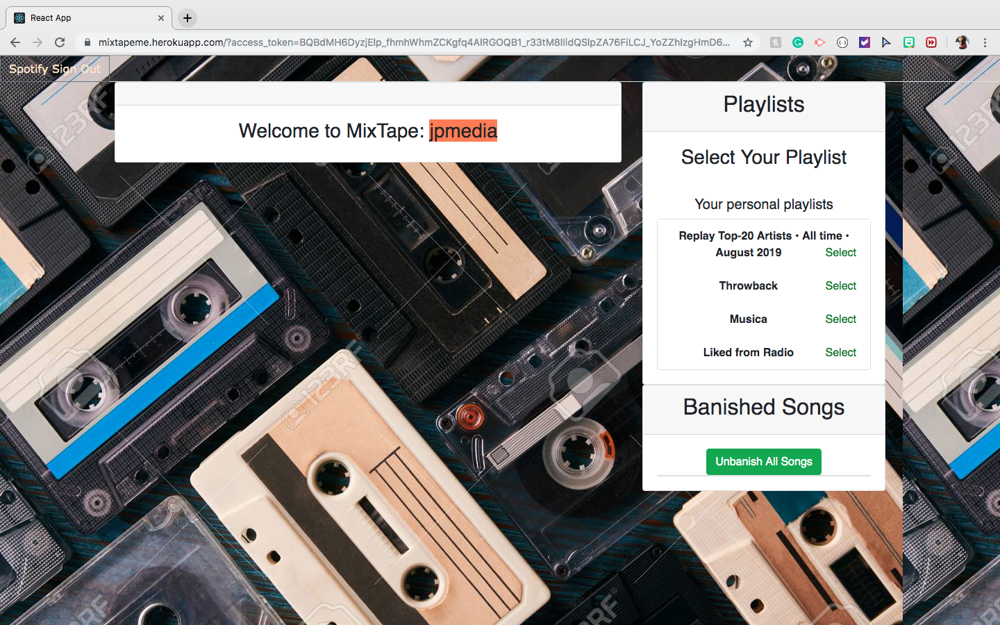
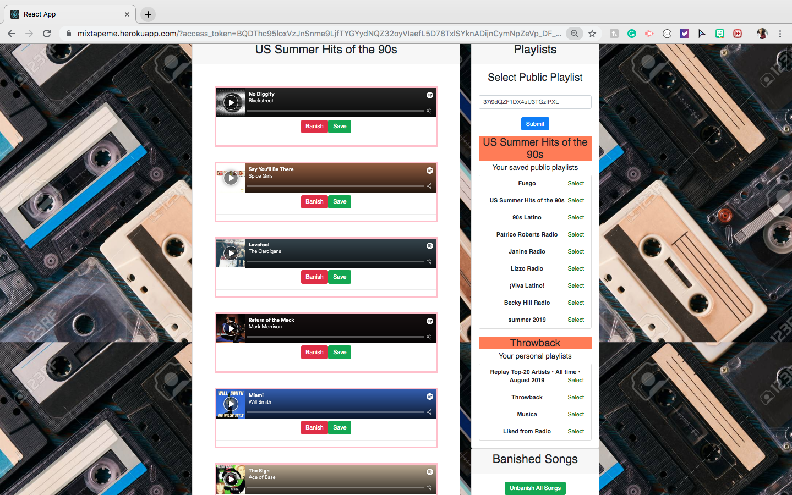

# Mixtape (Smarter Spotify Playlists)
​
## Table of Contents
* [About](#about)
* [Motivation](#motivation)
* [Live App](#live-app)
* [Setup](#setup)
* [Technologies Used](#technologies-used)
* [Screenshots](#screenshots)
* [Future Developments](#future-developments)
​
​
## About:
We created an app that will allows users who use Spotify to add/banish songs from their favorite playlists. They will have the ability to choose from their current personal playlists which playlist they would like to add the new songs to from a favorite playlist. Also when they banish a song they will be able to keep track of which songs have been banished. They will be able to preview the songs before they add them or banish them which helps with the process of creating the perfect playlist the user is looking to have.
​
## Motivation:
Mixtape was created to help Spotify users create they're dream playlist with ease. We wanted to give users the ability to see their favorite playlists and see what new songs have been added with the ability to add favorite songs to their own favorite playlists. We also wanted to give them the ability to 'banish' songs that they dont want to hear with the option to unbanish them if they choose to hear them again. 
​
## Live App:
Deployed on Heroku: [https://mixtapeme.herokuapp.com]

​
## Setup
Steps to run app on local server
- git clone the repo
- npm install
- npm start
​
## Technologies Used:
Application is a Full-Stack MERN App: 
- NodeJS
- express
- React
- MongoDB
- Mongoose
- Spotify API (OAuth 2.0)
- Spotify Web API node
- React Spotify Player
- Bootstrap
​
## ScreenShots
​

​

​

​
​
## Future Developments:
- Create one player instead of multiple players on the page 
- Create a second page to view Banished songs 
​
​
## Authors 
Nick S. 
Kat L. 
Kenyel B.
Jacqueline P.